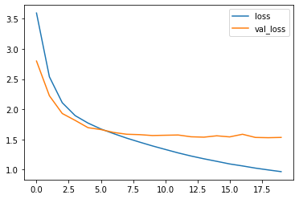
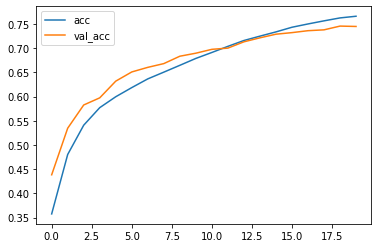

# Khóa luận tốt nghiệp

## Đề tài: ỨNG DỤNG HỌC SÂU ĐỂ CẢI TIẾN MÔ HÌNH PHÂN TÍCH CÂU HỎI TRONG BÀI TOÁN TRẢ LỜI

<h3>1. Phương hướng giải quyết</h3>

<h3>2. Mô hình tìm trọng số của từ</h3>
<ul>
<li>Phân tích không gian ngữ cảnh</li>
<li>Phân tích postag của từ</li>
<li>Phân tích loại câu hỏi ai, cái gì, con gì...</li>
</ul>

<h3>3. Ứng dụng trọng số vào thuật toán BM25</h3>
<table>
    <thead>
        <th></th>
        <th>Accuracy</th>
        <th>F1-score</th>
    </thead>
    <tbody>
        <tr>
            <td>BM25</td>
            <td>83.34%</td>
            <td>90.92%</td>
        </tr>
        <tr>
            <td>BM25 cải tiến</td>
            <td>85.87%</td>
            <td>92.40%</td>
        </tr>
    </tbody>
</table>
<h3>4. Tinh chỉnh mô hình RoBERTa</h3>

    
    

<table style = "width: 50%;">
    <thead>
        <th>Accuracy</th>
        <th>F1-score</th>
    </thead>
    <tbody>
        <tr>
            <td>73%</td>
            <td>73%</td>
        </tr>
    </tbody>
</table>
